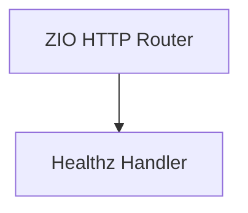

# Design Document

## Overview

Add a lightweight `GET /healthz` endpoint in `apps/api` using ZIO HTTP that always returns HTTP 200 with `{ status: "ok" }` and performs no external dependency checks. The endpoint is unauthenticated and intended for uptime monitoring.

## Steering Document Alignment

### Technical Standards (tech.md)
No steering documents are present. The design uses ZIO HTTP as the intended server stack and keeps logic simple with minimal dependencies.

### Project Structure (structure.md)
No steering documents are present. The implementation will follow standard SBT/Scala source layout under `apps/api/src/main/scala` and match any existing routing conventions found in the module.

## Code Reuse Analysis
No API source code exists yet under `apps/api/src`. The design assumes a minimal ZIO HTTP routing layer will either already exist or be introduced in the implementation task. The health check handler should reuse any existing JSON/rendering utilities if present.

### Existing Components to Leverage
- **None found**: `apps/api/src` has no Scala sources at this time.

### Integration Points
- **ZIO HTTP routing layer**: Register `GET /healthz` alongside existing routes (if present).
- **No database or external services**: The endpoint is intentionally standalone.

## Architecture

A single handler function returns a fixed JSON body and HTTP 200. The route is registered in the ZIO HTTP router with no middleware requirements (no auth, no DB).

### Modular Design Principles
- **Single File Responsibility**: Keep the health handler focused on returning status only
- **Component Isolation**: Avoid coupling to other services or infrastructure
- **Service Layer Separation**: No service layer is needed for this endpoint
- **Utility Modularity**: Reuse existing JSON helpers if available; otherwise return a literal JSON string



## Components and Interfaces

### Healthz Route/Handler
- **Purpose:** Serve `GET /healthz` with `{ status: "ok" }`
- **Interfaces:** `GET /healthz` HTTP endpoint
- **Dependencies:** ZIO HTTP
- **Reuses:** Existing router and JSON utilities if present

## Data Models

### HealthzResponse
```
case class HealthzResponse(status: String)
```

## Error Handling

### Error Scenarios
1. **Scenario 1:** Router initialization fails (outside scope)
   - **Handling:** Standard API bootstrap error handling
   - **User Impact:** Service fails to start; health endpoint unavailable

2. **Scenario 2:** JSON serialization utility missing
   - **Handling:** Return a hardcoded JSON string `{ "status": "ok" }`
   - **User Impact:** None; response remains valid

## Testing Strategy

### Unit Testing
- Test the handler returns HTTP 200 and the expected JSON body.

### Integration Testing
- Exercise the full route via HTTP request to `GET /healthz`.

### End-to-End Testing
- Optional uptime check hitting `GET /healthz` in a deployed environment.
