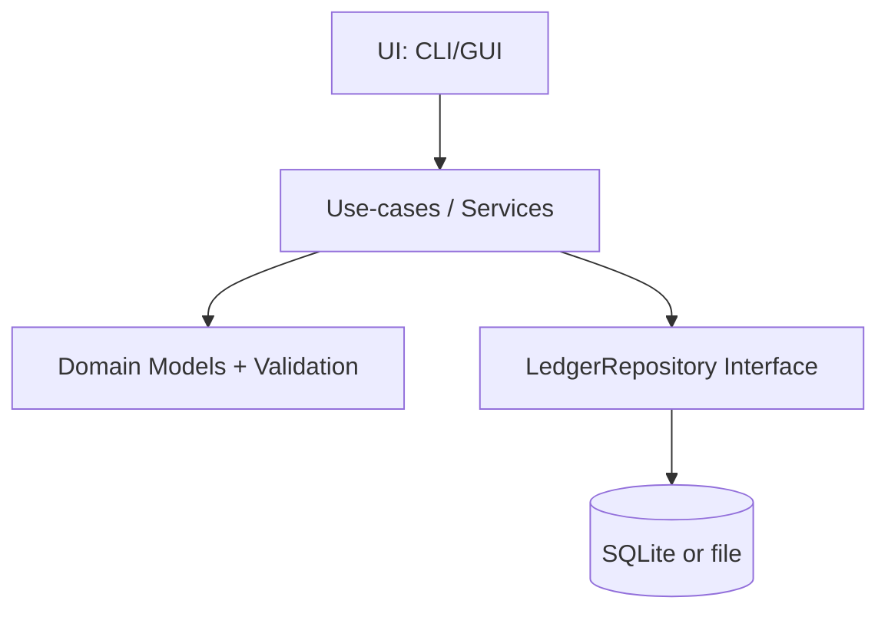

# Design Document

## Overview

本機能は、家計簿データを複式簿記の基本構造（勘定科目・仕訳・元帳）で保持し、家計用途の「簡易入力（支出/収入/振替）」を仕訳へ変換して永続化する。集計は仕訳（借方/貸方明細）を唯一の正とし、残高・収支・推移レポートを導出する。

前提: 現時点のリポジトリには実装がほぼ存在しないため、本設計は「ローカルファーストで拡張可能な最小構成」を提示する。

## Steering Document Alignment

`.spec-workflow/steering/` が未整備のため、以下は暫定の設計原則とする（steering 作成後に整合を再確認する）。

### Technical Standards (tech.md)
- ドメインモデル（複式簿記の整合）を中心に設計し、UI/永続化から独立させる
- 金額は浮動小数を避け、通貨最小単位（JPY=1円）で整数として扱う
- 仕訳の不変条件（借貸一致）を保存時に必ず検証する

### Project Structure (structure.md)
- `domain/`（モデル/不変条件）、`services/`（ユースケース）、`storage/`（永続化I/Fと実装）、`ui/`（CLI/GUI 等）の分離を推奨

## Code Reuse Analysis

既存コードがほぼ無いため、再利用対象は現状なし。今後の実装では、計算ロジック（残高算定/レポート）を純粋関数として切り出し、UIから再利用できる形にする。

## Architecture

### High-level
- **Domain**: `Book` / `Account` / `JournalEntry` / `Posting` / `ImportedTransaction`
- **Services (use-cases)**: 仕訳作成、簡易入力→仕訳生成、インポート、レポート生成、エクスポート/バックアップ
- **Storage**: 永続化I/F（例: `LedgerRepository`）と実装（例: SQLite/ファイル）
- **UI**: 入力/一覧/レポート表示（後続タスクで具体化）

### Modular Design Principles
- 仕訳バリデーションとレポート計算をドメイン/サービスに閉じ込める（UI・DBから独立）
- 永続化はリポジトリI/Fで抽象化し、SQLite→別ストレージへ置換可能にする

## Components and Interfaces

### LedgerRepository（永続化I/F）
- **Purpose:** 帳簿、科目、仕訳、インポート明細のCRUDと検索を提供する
- **Interfaces (examples):**
  - `createBook(name) -> bookId`
  - `listBooks()`
  - `upsertAccount(bookId, account)`
  - `listAccounts(bookId, { includeInactive })`
  - `createJournalEntry(bookId, entry)`
  - `updateJournalEntry(bookId, entryId, patch)`（編集ポリシーは後述）
  - `listJournalEntries(bookId, { from, to, accountId?, textQuery? })`
  - `createImportedTransactions(bookId, source, rows)`
  - `listImportedTransactions(bookId, { status })`
  - `linkImportedTransaction(bookId, importedId, entryId)`

### JournalEntryService（仕訳ユースケース）
- **Purpose:** 仕訳の作成/編集、整合性検証、簡易入力からの生成を担う
- **Dependencies:** `LedgerRepository`, `Clock`（日付既定値）, `IdGenerator`
- **Interfaces (examples):**
  - `createEntry(bookId, draft) -> entryId`
  - `createExpense(bookId, { date, payFromAccountId, expenseAccountId, amount, memo, splits? })`
  - `createIncome(bookId, { date, depositToAccountId, revenueAccountId, amount, memo })`
  - `createTransfer(bookId, { date, fromAccountId, toAccountId, amount, memo })`
  - `createCardPayment(bookId, { date, bankAccountId, cardLiabilityAccountId, amount, memo })`

### ReportingService（レポート）
- **Purpose:** 残高・収支・推移・元帳を仕訳から導出する
- **Interfaces (examples):**
  - `getTrialBalance(bookId, asOfDate)`
  - `getBalanceSheet(bookId, asOfDate)`
  - `getIncomeStatement(bookId, { from, to })`
  - `getLedger(bookId, accountId, { from, to })`

### ImportService（明細取り込み）
- **Purpose:** CSV取り込み、重複検知、未確定取引→仕訳化（確定）を担う
- **Interfaces (examples):**
  - `importCsv(bookId, { source, csv, mapping }) -> importedCount`
  - `confirmImported(bookId, importedId, { mappingToEntryDraft }) -> entryId`
  - `ignoreImported(bookId, importedId)`

## Data Models

### Book
- `id: string`
- `name: string`
- `createdAt: ISODateTime`

### Account
- `id: string`
- `bookId: string`
- `name: string`
- `type: "asset" | "liability" | "equity" | "revenue" | "expense"`
- `isActive: boolean`
- `createdAt: ISODateTime`

補助属性（任意）:
- `externalKey?: string`（インポート連携用の識別子）

### JournalEntry
- `id: string`
- `bookId: string`
- `date: ISODate`（会計日付）
- `memo?: string`
- `postings: Posting[]`
- `createdAt: ISODateTime`
- `updatedAt: ISODateTime`

### Posting
- `id: string`
- `entryId: string`
- `accountId: string`
- `side: "debit" | "credit"`
- `amount: number`（JPY前提: 1円単位の整数、常に正の値）
- `description?: string`（分割明細の摘要など）

### ImportedTransaction
- `id: string`
- `bookId: string`
- `source: string`（例: "bank-xxx", "card-yyy"）
- `date: ISODate`
- `amount: number`（正負はソース基準で保持してもよいが、確定時に仕訳へ正規化する）
- `payeeOrMemo?: string`
- `raw: object`（元データ）
- `dedupKey: string`（外部ID or ハッシュ）
- `status: "pending" | "linked" | "ignored"`
- `linkedEntryId?: string`

## Key Rules / Invariants

- **借貸一致**: `sum(debit.amount) == sum(credit.amount)` を満たす仕訳のみ保存可能
- **金額の型**: 金額は整数（JPY=円）。UI層で小数入力があれば整数へ正規化してから保存
- **削除ポリシー**: 監査性のため、仕訳は物理削除せず「取消仕訳」や「編集履歴」を推奨（初期は update を許可し、後から厳格化できる設計にする）
- **科目削除**: 使用済み科目は削除不可、`isActive=false` による無効化

## Error Handling

### Error Scenarios
1. **借貸不一致**
   - **Handling:** サービス層で検証し保存を拒否、差額と不足側（借方/貸方）を返す
   - **User Impact:** 入力フォームで差額表示し、修正箇所へ誘導

2. **参照不整合（存在しないaccountId/bookId）**
   - **Handling:** リポジトリ層のFK制約（SQLiteの場合）+ サービス層で事前検証
   - **User Impact:** 「選択された口座/科目が見つからない」エラー

3. **インポート重複**
   - **Handling:** `dedupKey` の一意制約で検知。スキップ/上書き（更新）を選択可能にする
   - **User Impact:** 重複候補の件数と選択肢を提示

## Storage Choice (Recommended)

初期実装は以下のいずれかを推奨（後続タスクで選定・確定）。
- **SQLite（推奨）**: 参照整合・クエリ・集計が容易。バックアップはDBファイルコピーで実現可能
- **ファイル（JSON/CSV）**: 最小構成だが集計・検索が重くなりやすい

## Testing Strategy

### Unit Testing
- 仕訳バリデーション（借貸一致、分割、カード返済等の簡易入力→仕訳生成）
- 残高計算（資産/負債/純資産、収支レポートの期間集計）
- インポート重複検知（`dedupKey` 生成と一意性）

### Integration Testing
- リポジトリ実装（SQLiteなら in-memory/テンポラリDB）でCRUDと制約確認
- 代表的ユースケース（支出→残高変化、カード利用→負債増、返済→負債減）

### End-to-End Testing
- 最小フロー: 科目作成 → 支出入力 → レポート確認 → エクスポート/復元（UIができ次第）
